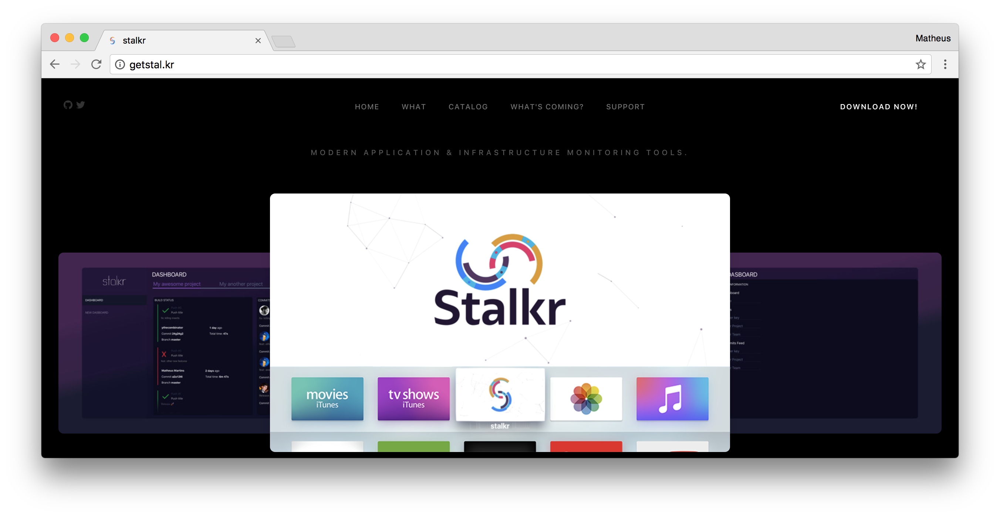

<h1 align="center">
	
	<br>
	<br>
</h1>

<br>
<br>

<p align="center">
 <a href="http://getstal.kr">stalkr</a> landing page.
</p>

<br>

---

## Table of Contents

- [Our Product](#our-product)
- [Usage](#usage)
- [Contributing](#contributing)
- [License](#license)
- [Credits](#credits)

## Our Product

<p align="center">
	
</p>

*stalkr* is a simple–yet powerful–set of tools which gathers data from both continuous integration and application infrastructure monitoring tools in order to make it easier to monitor the whole developing process, in a way the entire team can see at a glance, from the very first commit to the final release.

Although our experimental release is a simple client made for the  TV, we do intend to make *stalkr* clients available on as much platforms as possible, which include:

- Other **Smart TV** platforms–e.g. Android TV, webOS, Tizen etc.;

- **SmartWatch** platforms–e.g. watchOS, Android Wear etc.;

- Popular **Mobile** platforms–e.g. iOS, Android etc.;

- Popular **Desktop** OSs–e.g. macOS, Linux, Windows etc.;

- The **Web** itself.

If you can't wait to check it out:

<p align="center">
  <a href="https://itunes.apple.com/br/app/stalkr-dashboard/id1214212674">
    
  </a>
</p>

## Usage

### Getting Started

Make sure you have the main dependencies:

- [Git](http://git-scm.com/downloads)
- [NodeJS](http://nodejs.org/)

Clone this repository:

```sh
$ git clone https://github.com/getstalkr/getstalkr.github.io.git
```

Install all dependencies:

```sh
$ cd getstalkr.github.io
$ npm install
```

### Structure

If everything from the [Getting Started](#getting-started) section goes well, you should have this:

```
|-- docs/
|-- src/
|   |-- images/
|   |-- scripts/
|   |-- styles/
|   |-- templates/
|   |-- vendor/
|   |-- videos/
|   |-- config.json
|   |-- manifest.json
|-- tasks/
|   |-- deploy/
|       |-- gh-pages.js
|   |-- build/
|       |-- templates.js
|-- .babelrc
|-- .bowerrc
|-- .editorconfig
|-- .eslint
|-- .gitignore
|-- .styluslintrc
|-- .travis.yml
|-- bower.json
|-- package.json
|-- [...]
```

### Customization

For most of the updates/changes in our page, just go to the
[`config.json`](/src/config.json) file and change the value of variables.

### Workflow

All the tasks needed for development automation are defined in the
[`package.json`](package.json) *scripts* property and can be run via:

`npm run <command>`

Here is a summary of the main commands:

- `build:templates`: **compile** `.pug` files and **validate** the output.
- `build:scripts`: **lint**, **minify** and **concatenate** `.js` files.
- `build:styles`: **lint** and **compile** `.scss` files.
- `build:vendor`: **copy** `src/vendor` to `dist/vendor`.
- `build:images`: **optimize** raster and vector images.
- `build:videos`: **copy** `src/videos` to `dist/videos`.
- `build`: **run** all `build:` tasks.
- `watch`: **watch** `src/**/*` and **run** the corresponding `build:` tasks while serves the result.
- `test:npm`: **test** if project *npm dependencies* are up to date.
- `deploy`: **deploy** current `dist` to *GitHub Pages*.

## Contributing

Contributions are very welcome! If you'd like to contribute,
[these guidelines](.github/contributing.md) may help you.

## License

- [Stalkr Official Site](https://github.com/getstalkr/getstalkr.github.io) 
source code is licensed under the [MIT License]().

- Other stuff related to *Stalkr* itself - e.g. logo and visual identity -
which are available in this repo are licensed under the [Creative Commons  Attribution-NonCommercial-NoDerivatives 4.0 International](http://creativecommons.org/licenses/by-nc-nd/4.0/) License.

- The *Download on the App Store* badge has *All Rights Reserved to Apple Inc*.

**All contributions are assumed to be also licensed under the same.**

## Credits

- Some of the base stylization scripts and styles themselves were result of inspiration from
written by the [apex ping](apex.sh/ping/) team. Copyright © 2016 [Apex Software Inc.](https://apex.sh/ping).
